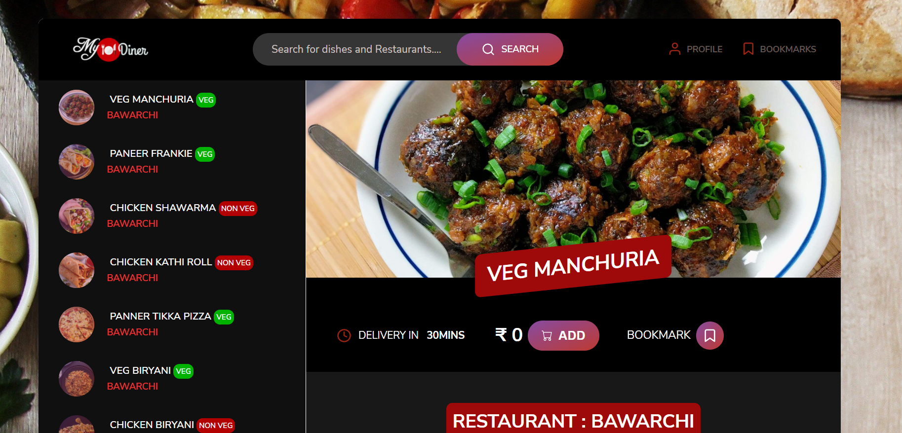
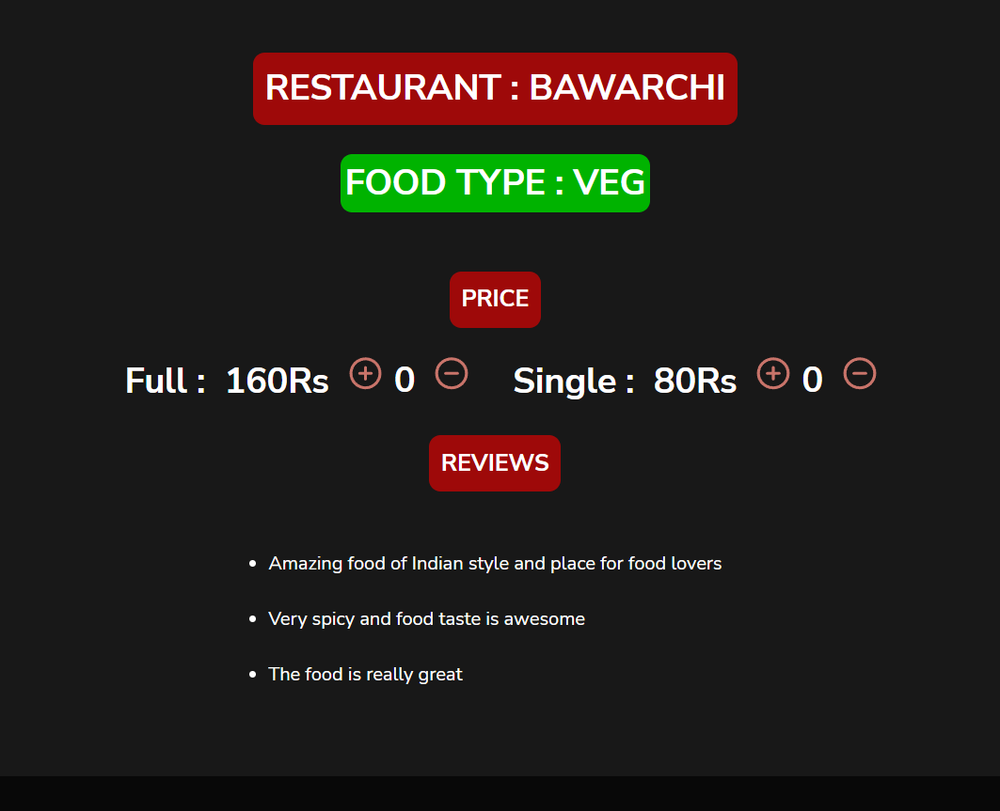
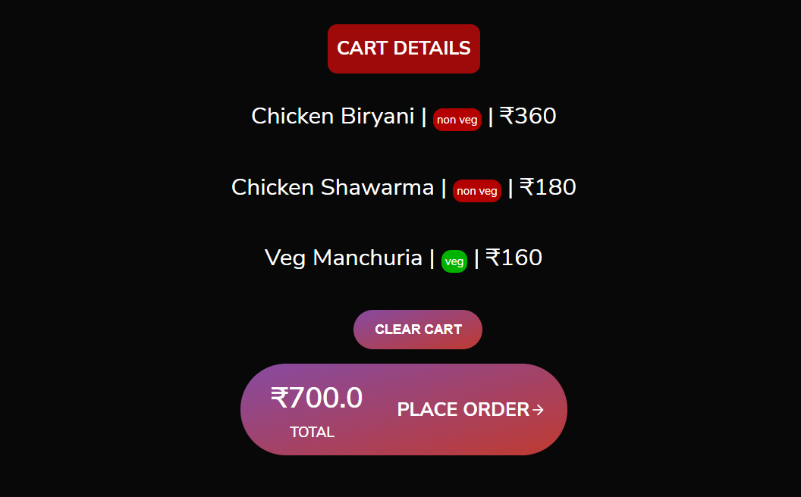
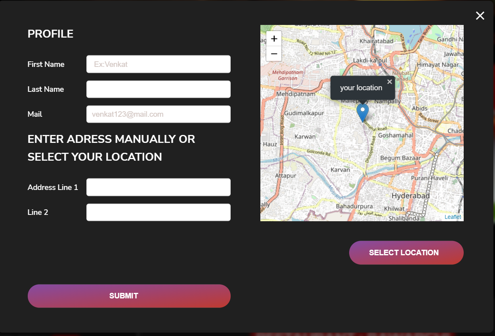
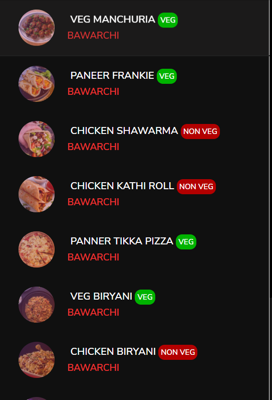

# My Diner

## Intro

Developed a front end web application using JavaScript, HTML,CSS to allow user to select food from menu of different Restaurants and add items to cart to place a order.

It displays price , quantity and delivery time of order so that user can adjust the order accordingly and user can bookmark  or unbookmark a item.

User can create profile and add address manually or can allow the application to get location which displays his current location on a map so the user can adjust the location on map.

## Demo

### Screenshot1

1. On left side user can see the results of his query and on right side user can see the selected item from the list

### Screenshot2

2. This shows all the details of order like Resataurant name, Delivery time, Prices and reviews

### Screenshot3

3. This shows all the items added to the cart

### Screenshot4

4.This shows the user profile he can enter address manually or can select location on the map

### Screenshot5

5.This shows the query list

